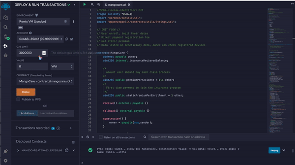
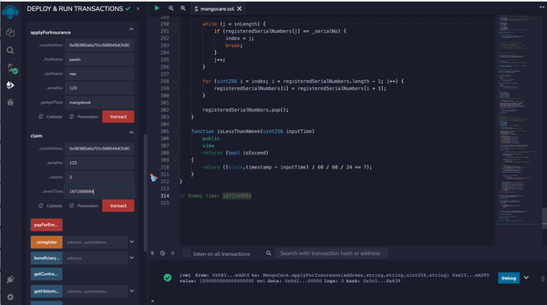
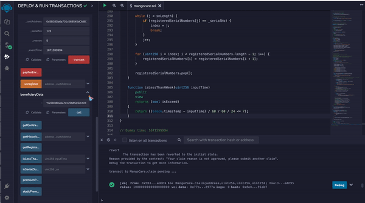

# Mango Care Insurance Smart Contract

MangoCare is a smart contract developed in Solidity that allows users to register, claim, and unregister for insurance coverage on their gadgets. The contract includes certain validations to simulate a real-life claim process.

## License

[MIT](https://choosealicense.com/licenses/mit/)

## Authors

- [@paulinavita](https://www.github.com/paulinavita)

## Features

- Enroll in the insurance program by inputting personal information and paying a registration fee
- Check static premium amount
- View registered devices
- Submit insurance claims with reasons and time of occurrence
- View insurance order history for specific devices

## Usage

- Deploy the contract on your vm
- The static premium amount can be viewed using the `staticPremiumPerEnrollment` variable.
- Use another account to sumbit an enrollemt to the insurance company. To start using MangoCare, first enroll in the insurance program by inputting personal information and paying the registration fee through the `payForEnrollment` function.
    - Serial number must be unique across user
    - Each user can only add 1 device to be insured for now
- To submit a claim, use the `submitClaim` function and input:
    - Your account address
    - Your registered serial number
    - The reason for the claim
    - The time of occurrence. 
    A premium will need to be paid for the claim through our system calculation.
- To view a list of registered devices, use the `getRegisteredDevices` function.
- Insurance order history for specific devices can be viewed using the `getHistoricalData` function.

## Example Error Case

- 1. Paying claim using unsufficient ether will throws exception.
- 2. Claim that submitted more than 7 days should throws exception as invalid claim.
- 3. Claim under reason 4 or other number bigger than 4 will be checked wheter it's valid or not by the system (dummy for now, using random truthy value).
- 4. Only contract owner can check historical data and list of registered devices.

## Screenshot

### Enrollment 

### Claim

### Beneficiary Check

